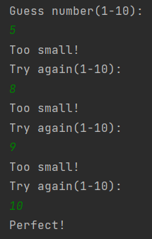

# 終極密碼(猜1-10)
##  題目
* clone `Main.java` 至電腦上，建立Check物件。
用Check物件判斷使用者猜數字過大或過小，引導使用者猜對數字。
* 注意，`Main.java` 不能更動，要保留先前`commit`的資料。
* 上傳至自己的github。
## 目的
1. 1-10避免測試過久。
2. 學習clone別人專案，自己新增內容。
3. 修改git上傳路徑。
## 執行結果
